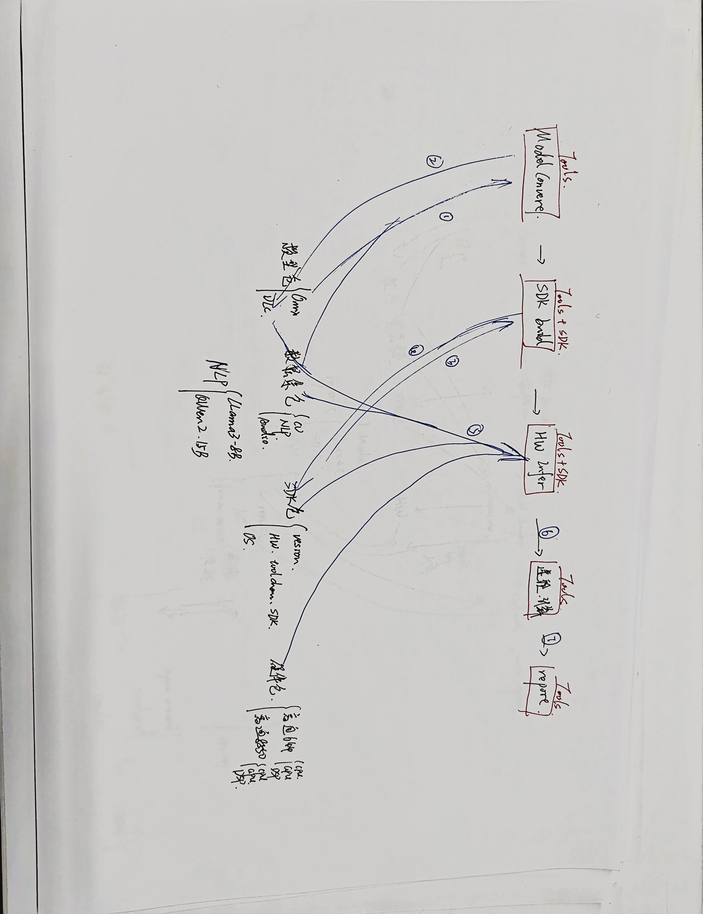

# 测试维度

## 1. 背景


## 2. 测试维度

- 功能性：完成大模型端侧推理的全流程的功能测试；  
- 指标性：  
	准确率指标  
	性能指标：推理的性能，推理时间，推理速度  
- 稳定性: 测试模型的稳定性，比如NPU利用率不能超过90%，内存占用不能超过80%等；程序长时间运行不崩溃等；  
- 持续性：软件版本迭代，模型版本迭代，持续性测试；  
- 兼容性：不同硬件平台，不同系统等差异的兼容性测试；  
- 可配置性：不同模型，不同硬件平台等差异可通过配置文件快速配置  


## 3. 输入准备材料

### 硬件环境

硬件环境需要提供：
- 系统环境
- 运行环境
- 硬件配置  
TODO： 硬件环境说明文档

### SDK方面

SDK配合需要提供：
- 配置文件配置参数说明；
- http封装接口；
- log设置和输出获取方式；
- 模型和数据集的输入，输出；
- SDK包格式；
- 运行环境说明，硬件和软件，需要设置的环境变量等；  


代码仓库：TODO：代码仓库链接


### 模型方面

模型方面需要提供：  
- 模型的输入输出，比如输入img/txt/audio等；  
- 模型的性能指标，比如时延/吞吐量/token速率；  
- 模型的精度指标；    
TODO：算法组/测试组补充完整指标

### 数据集方面

数据集方面需要提供：  
- 数据集的输入输出；  
- 数据集的精度指标；   
TODO：数据集组/测试组补充完整指标

## 4. 测试步骤

### 对接AI-Tools工具

AI-Tools工具功能点：  
1）SDK编译：编译生成SDK包;  
2）模型转换：将模型转换为适配SDK的格式;  
3）模型推理：将模型和SDK包发送到端侧后进行推理得到结果;  
4）数据传输和管理：将数据集发送到端侧进行测试;  
5）性能参数获取：获取端侧的性能参数;  
6）日志获取：获取端侧的日志;  
7）异常捕获：捕获端侧的异常，比如coredump等;  

TODO: 补充AI-tools工具的使用说明文档，配置说明文档，以及测试流程图

### 测试步骤

总体测试流程：
图片路径为doc/pic/fiboai-tools使用流程图.jpg
[]

1） 准备测试环境：准备测试环境，包括硬件环境，软件环境，测试数据集，测试模型等；  

2） AI-Tools工具中配置文件设置如下参数：  
- AI-SDK源码路径，编译目标平台和编译参数；
- 模型路径，模型量化和转换参数；
- 端侧设备的通信协议，如果是ssh则需要设置IP地址，端口号，用户名，密码，如果是adb则需要设置ADB地址等；
- 测试数据集路径，数据集名称，数据集格式等；  
设置完成后，可以直接运行完成以下步骤3~8， 亦可根据实际需求逐步运行以下步骤；  

3） 编译SDK：编译生成SDK包；  
步骤：在配置文件中设置AI-SDK源码路径，编译目标平台和编译参数，编译后安装的目标设备及目录；  

4） 模型转换：将模型转换为适配SDK的格式；  
步骤： 在配置文件中设置模型路径，模型量化和转换参数，转换后的模型及目录；  

5） 模型推理：将模型和SDK包发送到端侧后进行推理得到结果；  
步骤：在配置文件中设置端侧设备的通信协议，如果是ssh则需要设置IP地址，端口号，用户名，密码，如果是adb则需要设置ADB地址等，运行fiboai-tools的推理命令，得到推理结果；  

6） 数据传输和管理：将数据集发送到端侧进行测试；  
步骤：在配置文件中设置测试数据集路径，数据集名称，数据集格式等，将数据集发送到端侧进行测试；  

7） 性能参数获取：获取端侧的性能参数；  
步骤：在配置文件中设置端侧设备的通信协议，如果是ssh则需要设置IP地址，端口号，用户名，密码，如果是adb则需要设置ADB地址等，运行fiboai-tools的性能参数获取命令，得到性能参数；  
TODO：补充性能参数获取命令说明文档；

8） 日志获取：获取端侧的日志；  
步骤：有两种方式，在初始化设置保存日志目录或者根据运行命令获取终端输出的日志，日志中包含了端侧的运行日志，包括运行时间，运行结果等；  
TODO：补充日志获取命令说明文档；

9） 异常捕获：捕获端侧的异常；  
10） 结果分析：分析结果，判断是否符合预期；  
11） 重复性测试：多次运行结果是否一致；  
12） 长时间运行测试：运行一周无异常；


## 5. 测试样例

### 功能测试

#### Sample功能测试

Linux系统测试：一般提供命令行运行的方式进行测试：
命令行运行输入进行语言聊天后进行数据集测试
以下是命令行运行示例代码
```
cd /path/to/fiboai-tools/build/bin
# 声明环境变量
source /path/to/env.sh

# CV算法推理
./fiboai-tools -i /path/to/input/img -m /path/to/model -d /path/to/dataset -l /path/to/log

# NLP算法推理
./fiboai-tools -i /path/to/input/txt -m /path/to/model -d /path/to/dataset -l /path/to/log

# Audio算法推理
./fiboai-tools -i /path/to/input/audio -m /path/to/model -d /path/to/dataset -l /path/to/log
```
TODO: 补充命令行运行示例代码

安卓APP测试：直接在界面上测试APP的功能是否符合预期，比如是否可以进行语言聊天，是否可以进行数据集测试等；  
TODO：测试组补充完整


#### API功能测试

准备图片/语言/语音等输入素材，调用对应的输入接口，输出结果是否符合预期，其中接口均会提供HTTP接口对接测试系统  

一般包含以下接口：  
1）通用接口
- 初始化函数，初始化模型，硬件资源
- 释放函数
- 版本号函数
- 日志配置函数

2）CV类接口
- 图像处理类接口
- 视频处理类接口

3）NLP类接口：
- 文本处理类接口
- 语音处理类接口

4）Audio类接口：
- 音频处理类接口

5）硬件资源接口
- 硬件资源控制接口
- 硬件资源状态接口

TODO: 需要提供《API说明.md》

### 性能测试
1. 模型推理时的性能测试：
性能测试工具使用：使用AI-Tools中性能测试功能，设置对应的参数，运行对应的性能埔抓工具，再另外进程开启模型推理；
工具参数设置：TODO：补充性能测试工具参数设置文档；
2. 不同模型的性能测试：
捕获不同模型的性能指标内存占用，CPU占用，NPU利用率等；


### 稳定性测试
根据不同算法模型，不同的硬件平台，不同系统和版本，不同版本SDK包，不同语言环境等多种组合下，进行稳定性测试，包括：
1. 内存泄漏测试：测试内存泄漏情况
2. 异常测试：测试异常情况，如输入参数错误，内存泄漏等
3. 兼容性测试：测试不同平台的兼容性，如linux，android等
4. 性能测试：测试各个接口的性能指标是否符合预期范围内，比如NPU利用率不能超过90%，内存占用不能超过80%等
5. 长时间运行测试：测试各个接口的稳定性指标是否符合预期，比如运行一周无异常；
6. ...

1.长稳测试：
    - 7*24小时，sdk加载模型并持续请求推理接口，观察内存，cpu等占用正常，sdk crash无。
2.随机测试：
    - 24小时，使用monkey脚本随机生成行为调用sdk接口，观察内存，cpu等占用正常，sdk crash无。


## FAQ
性能测试框架对接
-> AI-Tools工具的性能测试框架对接 

准确性测试
-> CV算法准确率可以这里直接输出，NLP仅进行文本的输入输出，由测试的评估标注人员进行评估，评估结果是否符合预期。  

模型仓库、数据集库，设备库  
-> 测试人员搭建

AI-Tools可配置，配置参数文件 
-> TODO：补充配置参数文件说明文档


怎么抓取log和清洗，第三份日志分析系统  
评估体系, 什么标准认可度比较高  